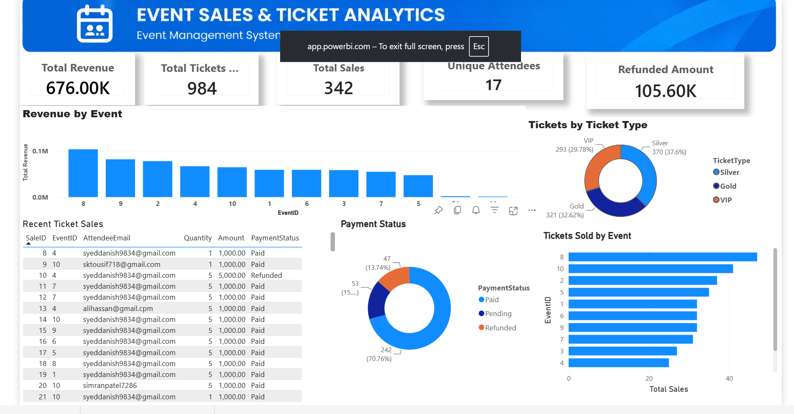

# 🎟️ Event Management System — Power BI Analytics

An interactive **Event Management System Analytics Dashboard** built using **Microsoft Power BI** to analyze event sales, ticket performance, attendee registration, and overall event business performance.

## 📊 Project Overview

The Event Management System (EMS) dashboard provides a centralized view of event-related data and helps users understand:

* Event performance
* Ticket sales and revenue
* Attendee registrations
* Event-wise performance
* Sales trends over time
* Ticket category performance
* Overall business KPIs

The dashboard is designed with interactive filters, KPI cards, charts, and functionality to make event data easier to analyze and understand.

## 📊 Project Overview
...

## 🔗 Live Dashboard

👉 [Click here to view the interactive Power BI Dashboard](https://app.powerbi.com/view?r=eyJrIjoiZjUyMTk5NWUtMzI4ZC00NmEwLTk3YjAtNjM2MjdkMWExNDJiIiwidCI6IjNkNjFhOTViLTczMjktNDdhYi1iNGZiLTMwYWEwYWMwZGMzNSJ9)
## 🛠️ Technologies & Tools
...


## 🛠️ Technologies & Tools

* **Microsoft Power BI**
* **Power Query**
* **DAX**
* **Microsoft Excel**
* **Data Modeling**
* **Interactive Visualizations**

## 📁 Project Structure

```text
EMS-PowerBI-Event-Analytics
│
├── PowerBI
│   └── EMS_Event_Analytics.pbix
│
├── Screenshots
│   └── EMS-Dashboard.png
│
├── Data
│   └── EMS_Data.xlsx
│
└── README.md
```

## 🎯 Key Features

### 📌 KPI Dashboard

The dashboard provides important business KPIs such as:

* Total Revenue
* Total Tickets Sold
* Total Events
* Total Attendees
* Average Ticket Price

### 📈 Sales & Revenue Analysis

* Revenue trends over time
* Event-wise revenue analysis
* Ticket sales performance
* Sales comparison across events

### 🎫 Ticket Analytics

* Ticket category analysis
* Ticket quantity sold
* Revenue generated by ticket type
* Event-wise ticket performance

### 👥 Attendee Analysis

* Registration trends
* Attendee distribution
* Event-wise attendee analysis
* Interactive filtering

### 🔎 Interactive Analysis

Users can interact with the dashboard using:

* Date filters
* Event filters
* Ticket category filters
* Slicers
* Cross-filtering
* Drill-through
* Interactive charts

## 🧮 Data Modeling

A structured Power BI data model was created to connect event, ticket, attendee, and date-related information.

A dedicated **Date Table** was created to support:

* Time intelligence
* Monthly analysis
* Yearly analysis
* Date-based filtering
* Trend analysis

Relationships between tables were configured to support accurate reporting and aggregation.

## 📐 DAX

DAX measures were created to calculate important business metrics, including:

* Total Revenue
* Total Tickets
* Total Events
* Total Attendees
* Average Ticket Price
* Time-based calculations

These measures are used throughout the dashboard to provide dynamic KPI values and analytical insights.

## 📊 Dashboard Visuals

The report includes interactive Power BI visuals such as:

* KPI Cards
* Bar Charts
* Column Charts
* Line Charts
* Donut Charts
* Tables
* Slicers

## 🖼️ Dashboard Preview



## 💡 Business Insights

The dashboard can help event management teams:

* Identify high-performing events
* Analyze revenue trends
* Understand ticket sales performance
* Compare event performance
* Monitor attendee registrations
* Support data-driven business decisions

## 🚀 Skills Demonstrated

This project demonstrates practical experience with:

* Power BI Dashboard Development
* Power Query
* DAX
* Data Cleaning & Transformation
* Data Modeling
* Relationships
* KPI Development
* Interactive Reporting
* Drill-through
* Slicers & Filters
* Business Data Analysis

## 👨‍💻 Project Author

**Syed Danish**

**Power Platform / Power BI Developer**

### Core Skills

Power BI DAX Power Apps` `Power Automate` `Dataverse` `SharePoint` `SQL Server`


⭐ If you find this project useful, feel free to explore the repository and dashboard.
